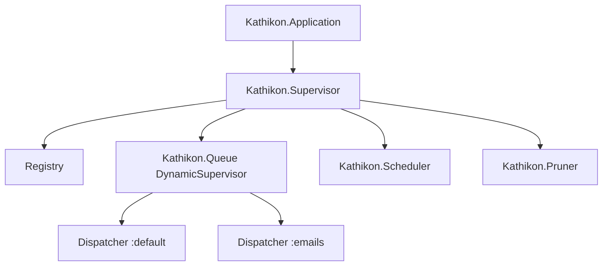
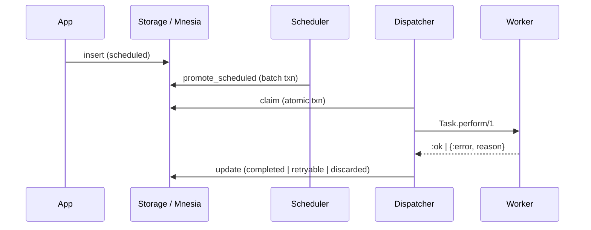

# Phase 1: Concepts

> **Historical:** This document describes Kathikon v0.1.0. For v0.2.0 see the [documentation index](documentation.md) and [job lifecycle](job_lifecycle.md).

This document explains the distributed systems, OTP, and Mnesia concepts behind Kathikon Phase 1.

## Distributed systems concepts

### Jobs as obligations

A job queue manages **obligations**: units of work that the system has committed to execute. The core invariant is:

> Work is either completed, retried, cancelled, or discarded — never silently lost.

This is the same fundamental contract as Sidekiq, Celery, and Oban, but Kathikon enforces it using BEAM primitives instead of external brokers.

### At-least-once execution

Kathikon provides **at-least-once** semantics on a single node:

1. A job is claimed atomically (state → `:executing`).
2. The worker runs `perform/1`.
3. On success, state → `:completed`.
4. On failure, state → `:retryable` with backoff.

A crash between steps 2 and 3 can leave a job in `:executing` without completion. Phase 2 (lifeline) will recover these orphaned jobs. This is the standard trade-off before lease-based recovery exists.

### Coordination vs. history

Mnesia is used as an **active coordination store**, not an archival database. Terminal jobs are pruned after a retention window. This mirrors how production queues (Sidekiq, SQS) treat completed work as short-lived metadata.

### Priority and fairness

When multiple jobs are available, claim order is:

1. Higher `priority` first
2. Earlier `available_at` as tiebreaker

This is **weighted prioritization**, not strict fairness. Starvation of low-priority jobs is possible under sustained high-priority load — operational controls in Phase 4 can address this.

### Scheduling

Jobs with `schedule_in` or `schedule_at` begin in `:scheduled`. The scheduler promotes them to `:available` in a **single Mnesia transaction** so sibling jobs become claimable together, avoiding priority inversions during promotion.

## OTP concepts

### Supervision tree



`one_for_one` strategy means a crashed dispatcher restarts without taking down the scheduler or pruner. Queue isolation is achieved by spawning one dispatcher per queue under a `DynamicSupervisor`.

### GenServer as control plane

Dispatchers, the scheduler, and the pruner are **control-plane** processes. They:

- Poll or tick on intervals
- Coordinate state transitions in Mnesia
- Spawn `Task` processes for the data plane (actual job execution)

This mirrors the Oban engine / queue producer pattern: a small number of coordinators, many short-lived workers.

### Registry for naming

`Kathikon.Dispatcher` processes register via `Registry` using `{:dispatcher, queue}` keys. This gives stable lookup without hard-coding pids and supports future cluster-wide registration in Phase 2.

### Task for execution

`Task.async/1` runs `perform/1` outside the dispatcher process so:

- Long-running jobs do not block polling
- Concurrency is bounded by the `running` map vs. `concurrency` config
- `handle_info` for `{:DOWN, ref, ...}` cleans up crashed tasks

### Explicit failure handling

Worker exceptions are rescued and treated as `{:error, reason}`. Bare throws and exits are caught. This prevents a misbehaving worker from crashing the dispatcher.

## Mnesia concepts

### Why Mnesia?

Mnesia is a **distributed, transactional, real-time database** built into OTP. For Kathikon it provides:

- Transactional job claims on the BEAM
- No external database or broker
- Natural fit for future cluster coordination (leases, ownership)

### Table design

| Table | Type | Purpose |
|-------|------|---------|
| `:kathikon_jobs` | `ordered_set` | Job records keyed by `id` |
| `:kathikon_queues` | `ordered_set` | Queue configuration metadata |

Jobs are stored as `{:kathikon_jobs, id, binary}` where `binary` is `:erlang.term_to_binary/1` of the job struct. This keeps the schema simple while the job model evolves.

### Storage copies

| Node type | Copy type |
|-----------|-----------|
| `nonode@nohost` (dev/test) | `ram_copies` |
| Named distributed node | `disc_copies` |

On named nodes, jobs survive restarts. On `nonode@nohost`, Mnesia is ephemeral — acceptable for local development.

### Transactions and claims

```elixir
:mnesia.transaction(fn ->
  jobs = all_jobs() |> filter_claimable(queue, now) |> sort_by_priority()
  case jobs do
    [] -> :mnesia.abort(:not_found)
    [job | _] ->
      :mnesia.write(updated_job)
      updated
  end
end)
```

The claim is **atomic**: two dispatchers cannot claim the same job on the same node. Cross-node double-claim requires leases (Phase 2).

### Scan vs. index

Phase 1 uses a full-table scan on claim. This is O(n) in job count but correct and simple. Production scale will require:

- Secondary index tables keyed by `{queue, state, priority}`
- Or dirty read replicas with write-through

Document this limitation explicitly so operators size Mnesia appropriately.

## Diagram: end-to-end job lifecycle



## Further reading

- [Erlang Mnesia User Guide](https://www.erlang.org/doc/apps/mnesia/mnesia_chap5)
- [OTP Design Principles](https://www.erlang.org/doc/system/design_principles)
- [Telemetry](https://hexdocs.pm/telemetry/)
- Kathikon Phase 1 operations: [phase-1-operations.md](phase-1-operations.md)
